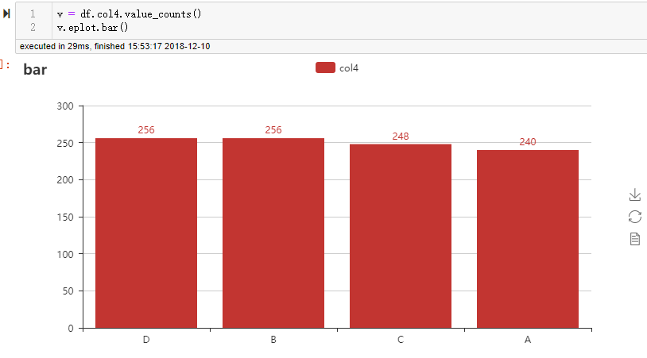
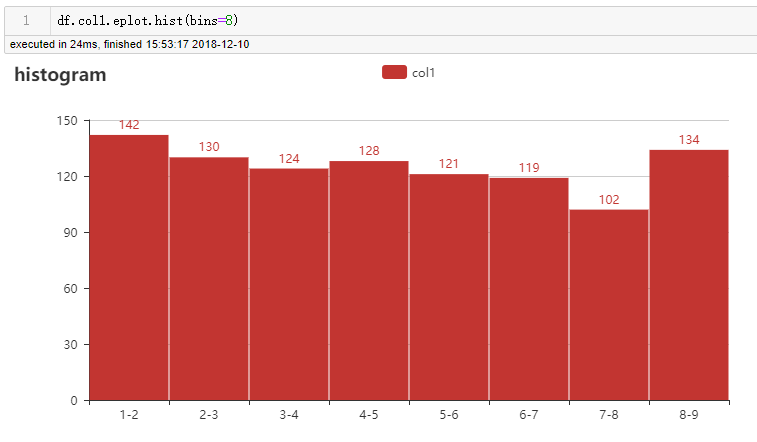
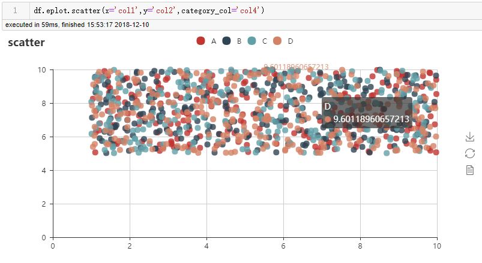
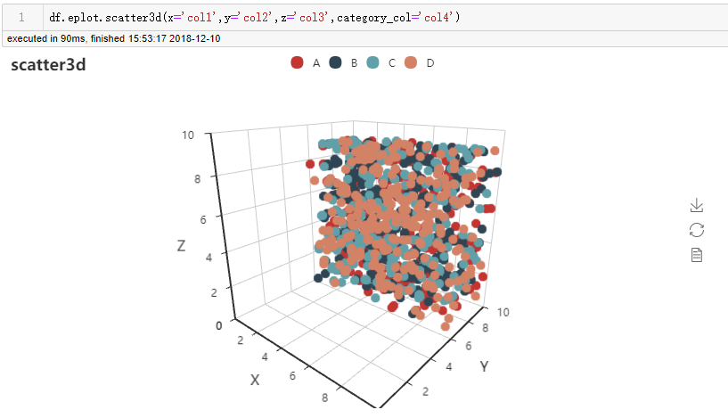
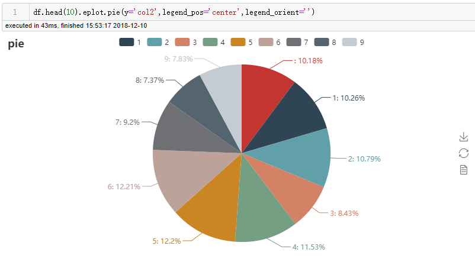
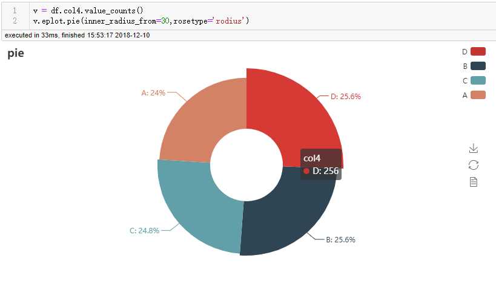
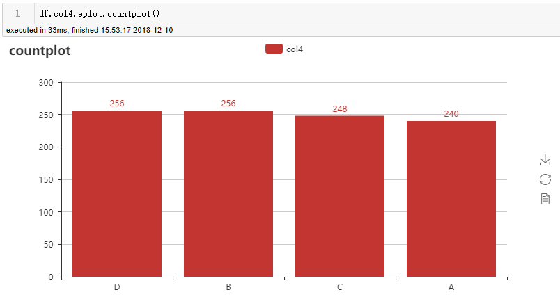
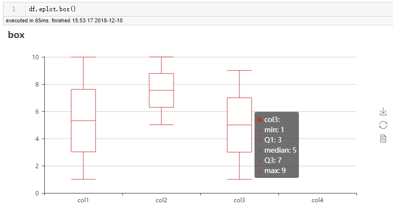
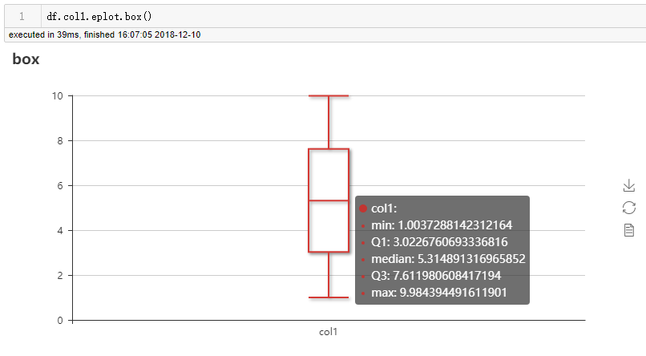

# eplot

`eplot` is a `pandas` interface for `pyecharts`.

As we know, `pyecharts` is a great python module as a wrapper for echarts, it is  easy to use in `pandas` by function `add` .

http://pyecharts.org/#/zh-cn/prepare

However, it will be more simple if it can be used as raw `pandas`  plot module, eg: `df.plot.bar()`.

Impired by `cufflinks` to `plotly`, I created these codes for the `pyecharts` smoothly useage in `pandas` , by only registering functions to the `DataFrame` or `Series` classes. 

As a result, we need not to call pyecharts  or creat pyecharts objects out of the `DataFrame`, we plot interacted figures in the `pyecharts` backend only in one line as follow:

Useage:

```python
import eplot
import pandas as pd
import numpy as np
df = pd.DataFrame([np.random.uniform(10,1,size=1000),
                   np.random.uniform(10,5,size=1000),
                   np.random.randint(1,high=10,size=1000),
                   np.random.choice(list('ABCD'),size=1000)],
                  index=['col1','col2','col3','col4']).T
```

# line


# bar



# histogram



# scatter






# pie



# rose pie



# countplot



# box





More examples can be found in the notebook `eplot useage example.ipynb`.